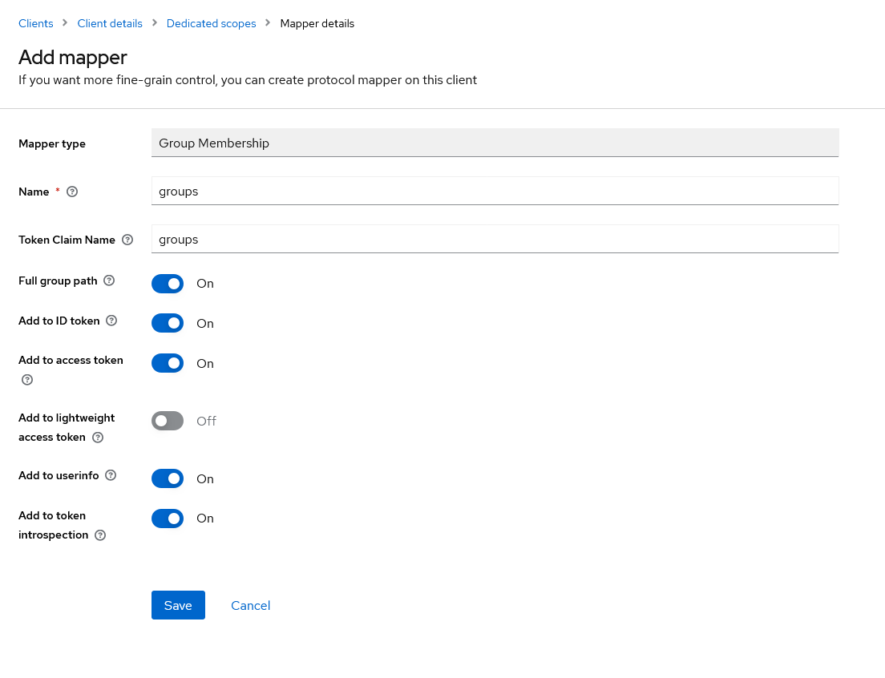

# Monitoring

## Overview
- General Notes
    - Ansible
    - Docker (Installation with Ansible)
    - Keycloak
- Documentation of the Monitoring Systems
    - Status Monitoring
    - IoT Monitoring (#TODO)
    - Platform Monitoring

## General Notes
### Using Ansible
- Easy setup via Ansible Playbook
- Installation of Ansible
    ```bash
    apt update
    apt install ansible
    ```
- Required files
    - `playbook.yml`: Definition of the necessary steps
    - `hosts.ini`: Definition of the hosts on which the playbook should be executed
        - Example for local host see [./ansible_basic/hosts.ini](./ansible_basic/hosts.ini)
- Running Ansible
    ```bash
    ansible-playbook -i path/to/hosts.ini path/to/playbook_status.yml
    ```
- Extension for using a `.env`
    - Using a bash script [./ansible_basic/ansible-playbook.sh](./ansible_basic/ansible-playbook.sh)
    - Call:
        ```bash
        ./ansible-playbook.sh -i path/to/hosts.ini path/to/playbook_status.yml
        ```

### Docker
- Docker is used for deploying the individual services
- Using an [Ansible Playbook](./ansible_docker/playbook_docker.yml) to install Docker is possible

### Creating a Client in Keycloak

Changes in the Keycloak admin interface
1) Navigate to Clients in the desired realm
2) Create a new client
    - General Settings
        - `Client type`: OpenID Connect
        - Set `Client ID` uniquely
        - `Name` and `Description` optional
    - Capability Config
        - 
    - Login Settings
        - `Valid redirect URIs` corresponds to the URL of the desired service
3) Adjustment of the scopes necessary
    - Navigate to the created client / Client Scopes
    - Select the created scope `${Client ID}-dedicated`
    - Add a mapper ("By Configuration")
        - 
4) Create the desired group and add the relevant people
5) Transfer the access data to [oauth2-proxy](https://github.com/oauth2-proxy/oauth2-proxy) from the client config
    - 

## Documentation of the Monitoring Systems
### Status Monitoring
- Using [Uptime-Kuma](https://github.com/louislam/uptime-kuma):
    - to check the availability of various services
    - to check server certificates
    - to visualize the system status
    - to notify in case of service failures

- Securing via [oauth2-proxy](https://github.com/oauth2-proxy/oauth2-proxy), so that a login via Keycloak is required.
    - Setting up the connection to Keycloak is necessary
    - Use of a defined group for release is required

- Using Traefik as a reverse proxy
    - Setting up certificates via Sertigo (An adaptation is required for other Certresolvers)

- Deployment via [Ansible Playbooks](./ansible_status_monitoring/playbook_status.yml) and Docker Compose (through Ansible)
    - [Configuration of Traefik](./ansible_status_monitoring/traefik.yml) is equipped with environment variables by Ansible

- Using environment variables (`.env`) in the root directory:
    ```env
    #Uptime-Kuma
    UPTIME_KUMA_PATH=               # Path to the files of Uptime-Kuma
    UPTIME_KUMA_HOST=               # DNS name / host of Uptime-Kuma

    # OAuth Plugin
    OAUTH_PROVIDER_URL=             # Keycloak URL from Keycloak
    OAUTH2_PROXY_CLIENT_ID=         # Client ID from Keycloak
    OAUTH2_PROXY_CLIENT_SECRET=     # Client Secret from Keycloak
    OAUTH2_PROXY_COOKIE_SECRET=     # Self-chosen cookie secret (seed string for secure cookies (optionally base64 encoded))
    OAUTH2_PROXY_ALLOWED_GROUP=     # Allowed groups from Keycloak
    OAUTH2_PROXY_BASIC_DOMAIN=      # Parent domain of UPTIME_KUMA_HOST
    OAUTH2_PROXY_FOOTER=            # Option to add a footer

    # TRAEFIK
    TRAEFIK_PATH=                   # Path to the files of Traefik
    TRAEFIK_ACME_EAB_KID=           # EAB_KID from Sertigo
    TRAEFIK_ACME_EAB_HMACENCODED=   # EAB_HMACENCODED from Sertigo
    TRAEFIK_ACME_EMAIL=             # Email for ACME account
    ```

### IoT-Monitoring
- #TODO

### Platform Monitoring
- Monitoring the status of the FIWARE platform components in implementation with Docker Swarm
- Monitoring by usage of [Prometheus](https://prometheus.io/) with multiple data collectors:
    - [cAdvisor](https://github.com/google/cadvisor):
        - Container Advisor provides information about the resource usage of the running containers.
        - This data is collected for each container deployed in the system.
        - Needed to run on each docker host
    - [Node exporter](https://github.com/prometheus/node_exporter)
        - Provides information about the hardware
    - CrateDB: 
        - Using the [Crate JMX HTTP Exporter](https://github.com/crate/jmx_exporter)
        - Needs to be implemented in the Docker-Container of CreateDB 
        - Build your image with the attached dockerfile - see [platform_monitoring/cratedb_exporter/](./platform_monitoring/cratedb_exporter/)
        

- More data collectors could be used, like:
    - [json_exporter](https://github.com/prometheus-community/json_exporter) 
        - Collect data from json http apis, e.g. orion or iot-agent
    - [MongoDB exporter](https://github.com/percona/mongodb_exporter)
        - The MongoDB exporter provides the metrics exposed by MongoDB monitoring commands
    - A overview about more exporters and intagrations gives the [prometheus doc](https://prometheus.io/docs/instrumenting/exporters/)

- Deployment via [compose](./platform_monitoring/docker-compose.yml)
    - Example for a docker swarm architecure, each data collecor is deployed on each host. Adapt the implementation in your system.
    - Configuration with the [prometheus.yml](./platform_monitoring/prometheus.yml)
        - In docker swarm, the configuration could be provided via the external configs
        - For more Information see [doc](https://github.com/portainer/templates/blob/master/images/monitoring/prometheus/config/prometheus.yml)
    - The monitoring data of prometheus should be stored in a volume to keep them outside of the container itself
- Grafana visualisation
    - Grafana could visualize the data from prometheus
    - Prometheus could be added as datasource - see [prometheus doc](https://prometheus.io/docs/visualization/grafana/)
    - A lot of dashboard templates could be used, like:
        - [Grafana Cadvisor exporter](https://grafana.com/grafana/dashboards/14282-cadvisor-exporter/)
        - [Grafana CrateDB Monitoring](https://grafana.com/grafana/dashboards/17174-cratedb-monitoring/)
        - [Grafana Node Exporter Full](https://grafana.com/grafana/dashboards/1860-node-exporter-full/)