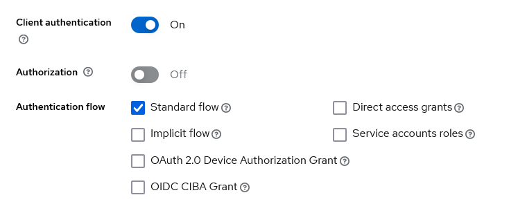
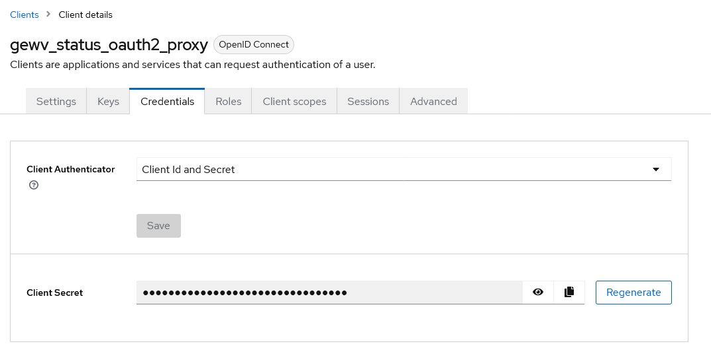

# Monitoring

## Übersicht
- Allgemeine Hinweise
    - Ansible
    - Docker (Installation mit Ansible)
    - Keycloak
- Dokumentation der Monitoring-Systeme
    - Status-Monitoring
    - IoT-Monitoring (#TODO)
    - Cluster-Monitoring


## Allgemeines
### Nutzung von Ansible
- einfache Einrichtung via Ansible-Playbook
- Installation von Ansible
    ```bash
    apt update
    apt install ansible
    ```
- Notwendige Dateien
    - `playbook.yml`: Definition der notwendigen Schritte
    - `hosts.ini`: Definition der Hosts auf denen das Playbook ausgeführt werden soll
        - Beispiel für lokalen Host siehe [./ansible_basic/hosts.ini](./ansible_basic/hosts.ini)
- Ausführen von Ansible
    ```bash
    ansible-playbook -i path/to/hosts.ini path/to/playbook_status.yml
    ```
- Erweiterung zur Verwendung einer `.env`
    - Nutzung eines Bash-Skripts [./ansible_basic/ansible-playbook.sh](./ansible_basic/ansible-playbook.sh)
    - Aufruf:
        ```bash
        ./ansible-playbook.sh -i path/to/hosts.ini path/to/playbook_status.yml
        ```

### Docker
- Docker wird zum Deployment der einzelnen Dienste genutzt
- Verwendung eines [Ansible-Playbooks](./ansible_docker/playbook_docker.yml) zur Installation von Docker möglich

### Anlage eines Clients in Keycloak

Änderungen im Admin-Interface von Keycloak
1) Im gewünschten Realm zu Clients navigieren
2) Neuen Client erstellen
    - General Settings
        - `Client type`: OpenID Connect
        - `Client ID ` eindeutig setzen
        - `Name` und `Description` optional
    - Capability Config
        - 
    - Login-Settings
        - `Valid redirect URIs` enspricht der URL des gewünschten Dienstes
3) Anpassung der Scropes notwendig
    - Navigation in erstellten Client / Client Scopes
    - Auswahl des mit erstellten Scopes `${Client ID}-dedicated`
    - Hinzufügen eines Mappers ("By Configuration")
        - 
4) Erstellung der gewünschten Gruppe und hinzufügen der betreffenden Personen
5) Übertragung der Zugangsdaten an [oauth2-proxy](https://github.com/oauth2-proxy/oauth2-proxy) aus Client Config
    - 


## Status Monitoring
- Nutzung von [Uptime-Kuma](https://github.com/louislam/uptime-kuma):
    - zur Prüfung der Erreichbarkeit von verschiedenen Diensten
    - zur Prüfung von Server-Zertifikaten
    - zur Visualisierung des Systemzustandes
    - zur Benachrichtigung beim Ausfall von Diensten

- Absicherung über [oauth2-proxy](https://github.com/oauth2-proxy/oauth2-proxy), sodass ein Login über Keycloak notwendig wird.
    - Einrichtung der Anbindung an Keycloak notwendig
    - Nutzung einer definierten Gruppe zur Freigabe erforderlich

- Nutzung von Traefik als Reverse-Proxy
    - Einrichtung von Zertifikaten über Sertigo

- Deployment via [Ansible-Playbooks](./ansible_status_monitoring/playbook_status.yml) und Docker Compose (durch Ansible)
    - [Konfiguration von Traefik](./ansible_status_monitoring/traefik.yml) wird durch Ansible mit Umgebungsvariablen ausgestattet

- Nutzung von Umgebungsvariablen (`.env`) im Root-Verzeichnis:
    ```env
    #Uptime-Kuma
    UPTIME_KUMA_PATH=               # Pfad zu den Dateien von Uptime-Kuma
    UPTIME_KUMA_HOST=               # DNS-Name / Host von Uptime-Kuma

    # OAuth Plugin
    OAUTH_PROVIDER_URL=             # Keycloak URL aus Keycloak
    OAUTH2_PROXY_CLIENT_ID=         # Client ID aus Keycloak
    OAUTH2_PROXY_CLIENT_SECRET=     # Client Secret aus Keycloak
    OAUTH2_PROXY_COOKIE_SECRET=     # selbst gewähltes Cookie Secret (seed string for secure cookies (optionally base64 encoded))
    OAUTH2_PROXY_ALLOWED_GROUP=     # Erlaubte Gruppen aus Keycloak
    OAUTH2_PROXY_BASIC_DOMAIN=      # Parent-Domain von UPTIME_KUMA_HOST
    OAUTH2_PROXY_FOOTER=            # Möglichkeit des Hinzufügens einer Fußzeile

    # TRAEFIK
    TRAEFIK_PATH=                   # Pfad zu den Dateien von Traefik
    TRAEFIK_ACME_EAB_KID=           # EAB_KID von Sertigo
    TRAEFIK_ACME_EAB_HMACENCODED=   # EAB_HMACENCODED von Sertigo
    TRAEFIK_ACME_EMAIL=             # EMAIL für ACME Account
    ```

## IoT-Monitoring
- #TODO

## Platform Monitoring
- Monitoring the status of the FIWARE platform components in implementation with Docker Swarm
- Monitoring by usage of [Prometheus](https://prometheus.io/) with multiple data collectors:
    - [cAdvisor](https://github.com/google/cadvisor):
        - Container Advisor provides information about the resource usage of the running containers.
        - This data is collected for each container deployed in the system.
        - Needed to run on each docker host
    - [Node exporter](https://github.com/prometheus/node_exporter)
        - Provides information about the hardware
    - CrateDB: 
        - Using the [Crate JMX HTTP Exporter](https://github.com/crate/jmx_exporter)
        - Needs to be implemented in the Docker-Container of CreateDB 
        - Build your image with the attached dockerfile - see [platform_monitoring/cratedb_exporter/](./platform_monitoring/cratedb_exporter/)
        

- More data collectors could be used, like:
    - [json_exporter](https://github.com/prometheus-community/json_exporter) 
        - Collect data from json http apis, e.g. orion or iot-agent
    - [MongoDB exporter](https://github.com/percona/mongodb_exporter)
        - The MongoDB exporter provides the metrics exposed by MongoDB monitoring commands
    - A overview about more exporters and intagrations gives the [prometheus doc](https://prometheus.io/docs/instrumenting/exporters/)

- Deployment via [compose](./platform_monitoring/docker-compose.yml)
    - Example for a docker swarm architecure, each data collecor is deployed on each host. Adapt the implementation in your system.
    - Configuration with the [prometheus.yml](./platform_monitoring/prometheus.yml)
        - In docker swarm, the configuration could be provided via the external configs
        - For more Information see [doc](https://github.com/portainer/templates/blob/master/images/monitoring/prometheus/config/prometheus.yml)
    - The monitoring data of prometheus should be stored in a volume to keep them outside of the container itself
- Grafana visualisation
    - Grafana could visualize the data from prometheus
    - Prometheus could be added as datasource - see [prometheus doc](https://prometheus.io/docs/visualization/grafana/)
    - A lot of dashboard templates could be used, like:
        - [Grafana Cadvisor exporter](https://grafana.com/grafana/dashboards/14282-cadvisor-exporter/)
        - [Grafana CrateDB Monitoring](https://grafana.com/grafana/dashboards/17174-cratedb-monitoring/)
        - [Grafana Node Exporter Full](https://grafana.com/grafana/dashboards/1860-node-exporter-full/)