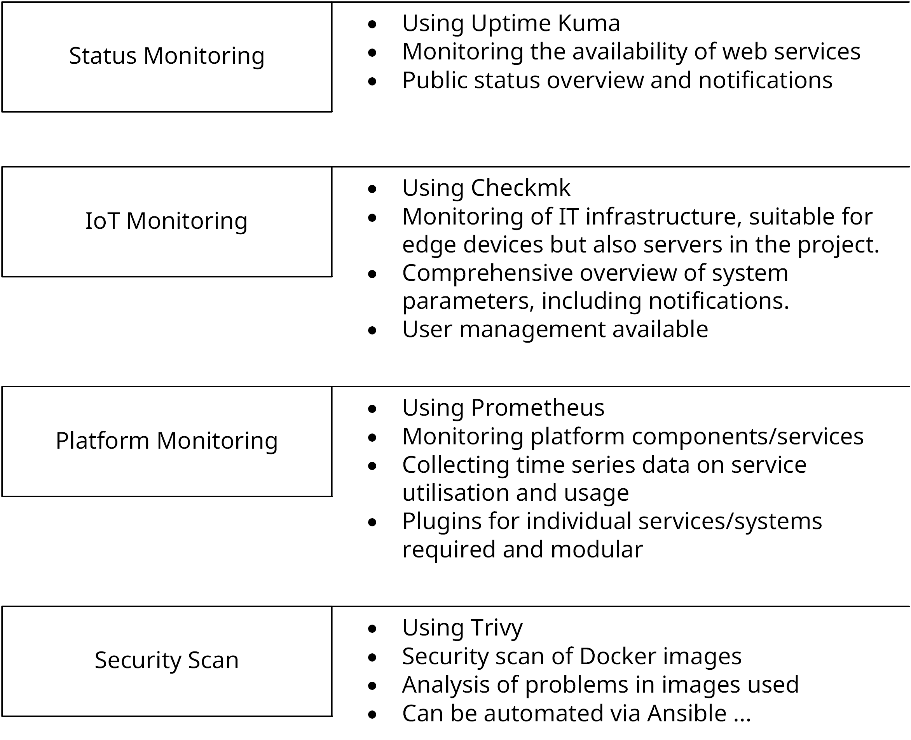
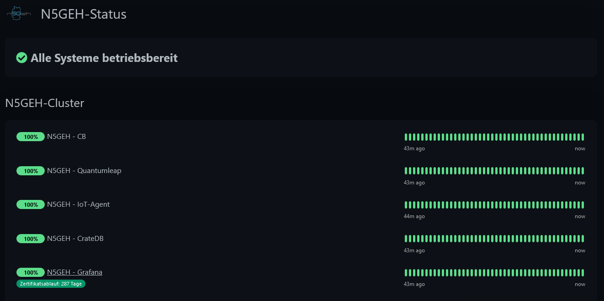
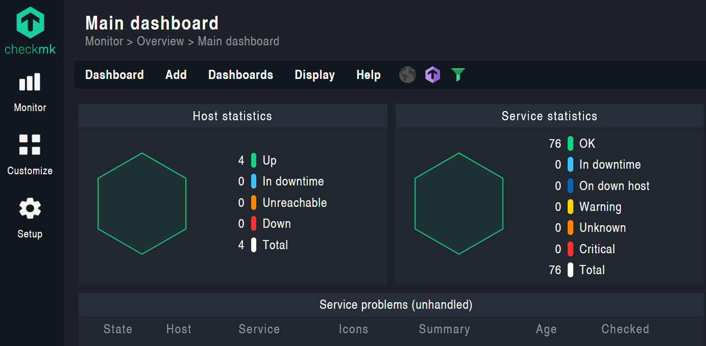

# Monitoring Tutorial

## Overview
This repository contains information on potential monitoring solutions for the N5GEH platform. These are just suggestions for specific solutions for different use cases. The repository contains sections on:
- [General Notes](#general-notes)
    - [Usage of Ansible](#using-ansible)
    - [Install Docker with Ansible](#docker)
    - [Creating a Keycloak-Client](#creating-a-client-in-keycloak)
- Documentation of the Monitoring Systems
    - [Status Monitoring](#status-monitoring)
    - [IoT Monitoring](#iot-monitoring)
    - [Platform Monitoring](#platform-monitoring)
    - [Security Scan](#security-scan)

The objectives and possibilities of the individual sub-areas are presented in the following overview. There is some overlap, as the various approaches are partly redundant.



## General Notes
### Using Ansible
- Easy setup via Ansible Playbook
- Installation of Ansible
    ```bash
    apt update
    apt install ansible
    ```
- Required files
    - `playbook.yml`: Definition of the necessary steps
    - `hosts.ini`: Definition of the hosts on which the playbook should be executed
        - Example for local host see [./ansible_basic/hosts.ini](./ansible_basic/hosts.ini)
- Running Ansible
    ```bash
    ansible-playbook -i path/to/hosts.ini path/to/playbook_status.yml
    ```
- Extension for using a `.env`
    - Using a bash script [./ansible_basic/ansible-playbook.sh](./ansible_basic/ansible-playbook.sh)
    - Call:
        ```bash
        ./ansible-playbook.sh -i path/to/hosts.ini path/to/playbook_status.yml
        ```

### Docker
- Docker is used for deploying the individual services
- Using an [Ansible Playbook](./ansible_docker/playbook_docker.yml) to install Docker is possible

### Creating a Client in Keycloak
In order to use this setup with Keycloak, you will need to set up a client in Keycloak. See the tutorial for this [Keycloak connection](./keycloak_connection/readme.md) for more information.

## Documentation of the Monitoring Systems
### Status Monitoring
- Using [Uptime-Kuma](https://github.com/louislam/uptime-kuma):
    - to check the availability of various services
    - to check server certificates
    - to visualize the system status
    - to notify in case of service failures

- You can adjust the language and add your own components. The tool gives you a status page, like this: <br>
    
- It is also possible to use Uptime-Kuma in a simple Docker Compose setup. See the project's documentation for details. 
- Securing via [oauth2-proxy](https://github.com/oauth2-proxy/oauth2-proxy), so that a login via Keycloak is required.
    - Setting up the connection to Keycloak is necessary
    - Use of a defined group for release is required

- Using Traefik as a reverse proxy
    - Setting up certificates via Sertigo (An adaptation is required for other Certresolvers)

- Deployment via [Ansible Playbook](./ansible_status_monitoring/playbook_status.yml) and Docker Compose (through Ansible):
    - [Configuration of Traefik](./ansible_status_monitoring/traefik.yml) is equipped with environment variables by Ansible

- Using environment variables (`.env`) in the root directory:
    ```env
    #Uptime-Kuma
    UPTIME_KUMA_PATH=               # Path to the files of Uptime-Kuma
    UPTIME_KUMA_HOST=               # DNS name / host of Uptime-Kuma

    # OAuth Plugin
    OAUTH_PROVIDER_URL=             # Keycloak URL from Keycloak
    OAUTH2_PROXY_CLIENT_ID=         # Client ID from Keycloak
    OAUTH2_PROXY_CLIENT_SECRET=     # Client Secret from Keycloak
    OAUTH2_PROXY_COOKIE_NAME=       # Name for the cookies
    OAUTH2_PROXY_COOKIE_SECRET=     # Self-chosen cookie secret (seed string for secure cookies (optionally base64 encoded))
    OAUTH2_PROXY_ALLOWED_GROUP=     # Allowed groups from Keycloak
    OAUTH2_PROXY_BASIC_DOMAIN=      # Parent domain of UPTIME_KUMA_HOST
    OAUTH2_PROXY_FOOTER=            # Option to add a footer (optional)
    OAUTH2_TEMPLATES_PATH=          # Path for the templates to adjust the login flow (automatic redirect to the Provider)
    OAUTH2_PROVIDER_DISPLAY_NAME=   # Name of the Lofin povider (optional - only a text on the button, if there is no automatic redirect)

    # TRAEFIK
    TRAEFIK_PATH=                   # Path to the files of Traefik
    TRAEFIK_ACME_EAB_KID=           # EAB_KID from Sertigo
    TRAEFIK_ACME_EAB_HMACENCODED=   # EAB_HMACENCODED from Sertigo
    TRAEFIK_ACME_EMAIL=             # Email for ACME account
    TRAEFIK_ACME_HTTP_CASERVER=     # Certresolver if the http_resolver is used
    ```

### IoT-Monitoring
- Monitoring of IoT-Devices via [Checkmk](https://checkmk.com) with notifications via [Rocket.Chat](https://www.rocket.chat/) or [Matrix](https://matrix.org)
- The tool provides an overview of hardware and software details such as memory usage and load. The first overview shows whether all the checks are OK or if there are any problems. This image shows an example. <br>
    
- Monitoring tool for various IoT devices and systems - see documentation [docs.checkmk.com](https://docs.checkmk.com/latest)
    - You need to add the devices yourself. See the official documentation for this.
    - The ways in which you can add devices depend on the licence type you use.
- Individual extensions can be added manually, or like the [Rocket.Chat Plugin](https://exchange.checkmk.com/p/rocketchat-notification-1) via Ansible Playbook. A Documentation is avaiable under the [checkmk Docs](https://docs.checkmk.com/latest/en/mkps.html). In the Community Edition, plugins could be installed from the command line (in the Docker Container):
    - `omd su ${CMK_SITE_ID}`
    - `mkp add ${path_to_plugin.mkp}`
    - `mkp enable $ {name_of_plugin}`
- The following ENVS are required for deploying:
    ```
    CMK_PATH=       # Path where CheckMk stores the monitoring data and configuration.
    CMK_SITE_ID=    # ID of your monitoring site
    CMK_PASSWORD=   # Set an initial password for the cmkadmin user.
    CMK_URL=        # URL / DNS-Name for the CMK-Host
    ```
- Deployment is possible via Docker Compose or [Ansible Playbook](./ansible_service_monitoring/playbook_cmk.yml):
    `./ansible_basic/ansible-playbook.sh -i ./ansible_basic/hosts.ini /${PATH_TO}/ansible_service_monitoring/playbook_cmk.yml`

- Notifications through [Rocket.Chat](https://www.rocket.chat/) must be configured through the GUI. For more information (including other notification methods), see the [Checkmark Docs](https://docs.checkmk.com/latest/en/notifications.html).

- The plugin for [Notifications via Matrix](https://github.com/Hagbear/checkmk-matrix-notify) is deployed via the ansible notebook and needs to be configured via the GUI.

### Platform Monitoring
- Monitoring the status of the FIWARE platform components in implementation with Docker Swarm
    - It can also be used to collect data from IoT devices, but implementation is not as straightforward as it is shown above.
- Monitoring by usage of [Prometheus](https://prometheus.io/) with multiple data collectors:
    - [cAdvisor](https://github.com/google/cadvisor):
        - Container Advisor provides information about the resource usage of the running containers.
        - This data is collected for each container deployed in the system.
        - Needed to run on each docker host
    - [Node exporter](https://github.com/prometheus/node_exporter)
        - Provides information about the hardware
    - CrateDB: 
        - Using the [Crate JMX HTTP Exporter](https://github.com/crate/jmx_exporter)
        - Needs to be implemented in the Docker-Container of CreateDB 
        - Build your image with the attached dockerfile - see [platform_monitoring/cratedb_exporter/](./platform_monitoring/cratedb_exporter/)
        

- More data collectors could be used, like:
    - [json_exporter](https://github.com/prometheus-community/json_exporter) 
        - Collect data from json http apis, e.g. orion or iot-agent
    - [MongoDB exporter](https://github.com/percona/mongodb_exporter)
        - The MongoDB exporter provides the metrics exposed by MongoDB monitoring commands
    - A overview about more exporters and intagrations gives the [prometheus doc](https://prometheus.io/docs/instrumenting/exporters/)

- Deployment via [compose](./platform_monitoring/docker-compose.yml)
    - Example for a docker swarm architecure, each data collecor is deployed on each host. Adapt the implementation in your system.
    - Configuration with the [prometheus.yml](./platform_monitoring/prometheus.yml)
        - In docker swarm, the configuration could be provided via the external configs
        - For more Information see [doc](https://github.com/portainer/templates/blob/master/images/monitoring/prometheus/config/prometheus.yml)
    - The monitoring data of prometheus should be stored in a volume to keep them outside of the container itself
- Grafana visualisation
    - Grafana could visualize the data from prometheus, like
    - Prometheus could be added as datasource - see [prometheus doc](https://prometheus.io/docs/visualization/grafana/)
    - A lot of dashboard templates could be used, like:
        - [Grafana Cadvisor exporter](https://grafana.com/grafana/dashboards/14282-cadvisor-exporter/)
        - [Grafana CrateDB Monitoring](https://grafana.com/grafana/dashboards/17174-cratedb-monitoring/)
        - [Grafana Node Exporter Full](https://grafana.com/grafana/dashboards/1860-node-exporter-full/)

### Security scan
- Information about possible solutions for a [security scan](./security_scan/readme.md) are avaiable in this repo.

## License

This tutorial is licensed under the MIT License [MIT License](LICENSE).

## Further project information

<a href="https://n5geh.de/"> </a>

## Acknowledgments

We gratefully acknowledge the financial support of the Federal Ministry <br /> 
for Federal Ministry for Economic Affairs and Energy, promotional reference 
03EN1030A.

<a href="https://www.bundeswirtschaftsministerium.de/Navigation/EN/Home/home.html">  </a>